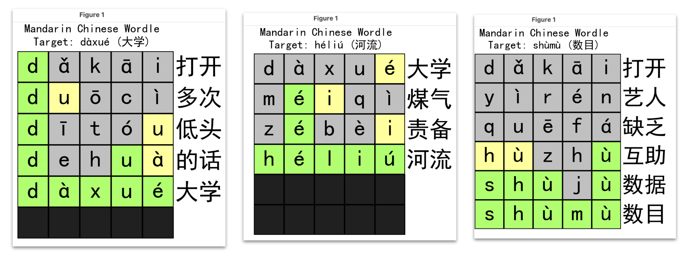
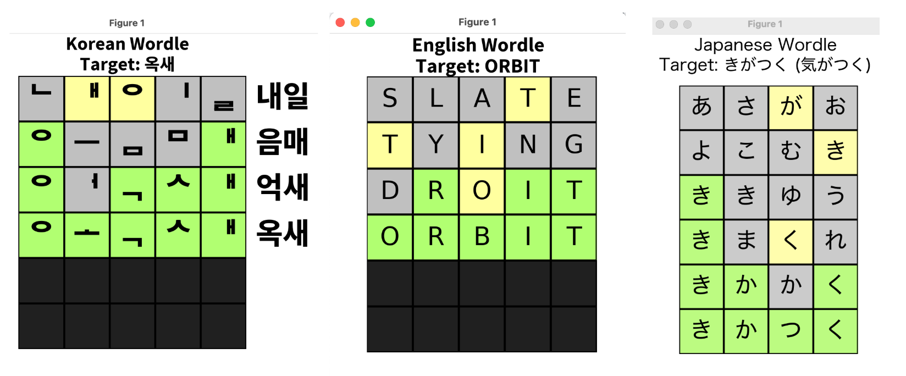

# CS 238: Worduolingo (Wordle Meets Duolingo 🦉💚)
Project for CS238 on Multilingual Wordle (English, Japanese, Korean, Chinese, or at least the languages I have some experience in)





## Running Wordle Solver

```zsh
python3 <languageName>Wordle.py <wordToSolve>
```

for the Chinese Wordle, the secret word should be in simplified Hanzi characters; and for Japanese, the secret word input should be in hiragana script. For Korean, you can just use Hangul (not romanization), and for English, the Latin alphabet will suffice.

## Running Simulation Tests

With the baseline approach:

```zsh
python3 run_simulations.py --language <languageName> --useBaseline
```

With the gain-of-information probabilistic model to optimize guessing:

```zsh
python3 run_simulations.py --language <languageName> 
```

